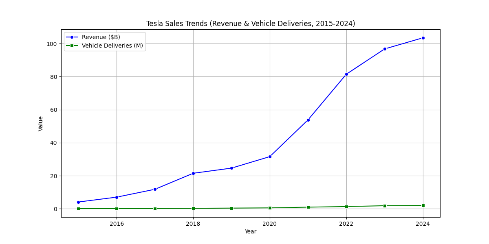
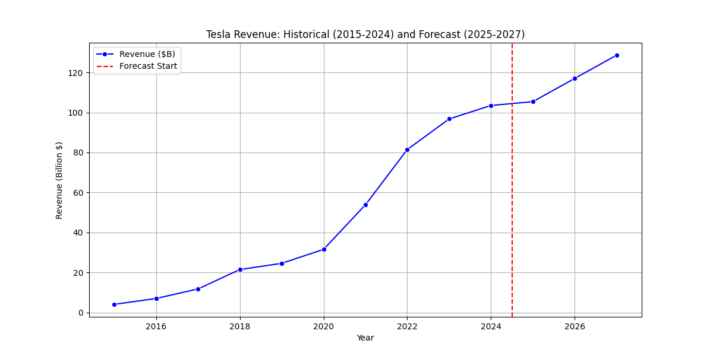
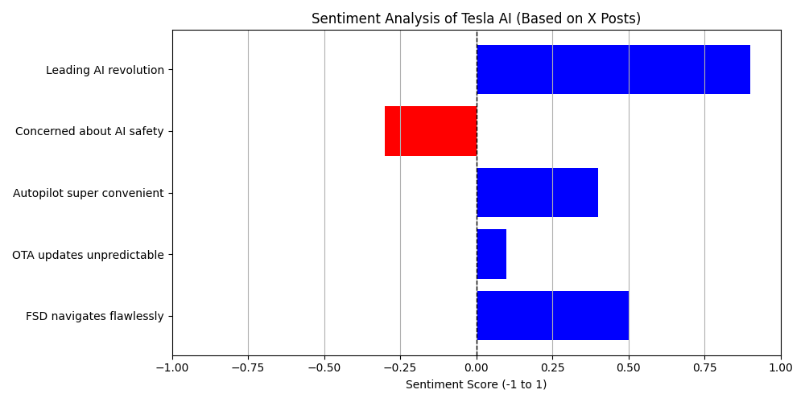

# Tesla Digital Transformation Analysis

This repository contains my analysis of Tesla, Inc.'s digital transformation for my university assignment, completed in May 2025. As a student, I was fascinated by Tesla’s innovative use of technology, and this project allowed me to explore its impact through data analysis and sentiment evaluation. Below, you’ll find all the files and resources related to my report, including the code, figures, data, and final document.

## Project Overview
My project investigates Tesla’s digital transformation, focusing on its use of artificial intelligence (AI), over-the-air (OTA) updates, and data-driven strategies. I analyzed Tesla’s sales trends from 2015 to 2024, predicted future revenue for 2025–2027, and conducted sentiment analysis on X posts about Tesla’s AI. The report also discusses challenges, future trends, and reflections on feedback I received during the process.

### Key Findings
- **Sales Trends**: Tesla’s revenue grew from $4.05 billion in 2015 to $103.50 billion in 2024, with a predicted $113.76 billion in 2025.
- **Sentiment Analysis**: Public sentiment on Tesla’s AI is mostly positive (average score 0.34), but safety concerns exist (score of -0.30 for one post).
- **Challenges**: Regulatory hurdles and ethical concerns around AI safety need addressing.
- **Future Trends**: Full autonomy and sustainability initiatives could shape Tesla’s future.

## Repository Structure
- **`code/`**: Contains the Python script used for analysis.
  - `Tesla_Sales_AI_Analysis.py`: The script for sales forecasting and sentiment analysis.
- **`figures/`**: Contains the generated plots.
  - `tesla_sales_trends.png`: Sales trends (2015–2024).
  - `tesla_revenue_forecast.png`: Revenue forecast (2015–2027).
  - `tesla_ai_sentiment.png`: Sentiment analysis of X posts.
- **`docs/`**: Contains the final report.
  - `Tesla_Digital_Transformation_Report.docx`: The complete report with all sections.

## How to Use This Project
If you’d like to reproduce my analysis, here’s how to get started:

1. **Clone the Repository**:
git clone https://github.com/Ehtishamali78/tesla-analysis.git
cd tesla-analysis

2. **Set Up the Environment**:
- Ensure you have Python 3 installed.
- Install the required libraries:
pip install pandas numpy matplotlib seaborn scikit-learn textblob

3. **Run the Analysis**:
- Navigate to the `code/` folder and run the script:
python Tesla_Sales_AI_Analysis.py

- This will generate the figures in the `figures/` folder.
4. **View the Report**:
- Open `docs/Tesla_Digital_Transformation_Report.docx` to read the full report, including the Abstract, Keywords, Introduction, Literature Review, Strategies, Data Analysis, Challenges, Reflections, and Conclusion.

## Figures
Below are the visualizations generated by the script:

- **Sales Trends (2015–2024)**:  

- **Revenue Forecast (2015–2027)**:  

- **Sentiment Analysis of Tesla AI**:  

## Acknowledgments
I’d like to thank my instructors and peers for their feedback, which helped me improve this project. Special thanks to the open-source community for providing tools like TextBlob and scikit-learn, which made my analysis possible.

## License
This project is for educational purposes and is not licensed for commercial use. Feel free to explore and provide feedback!